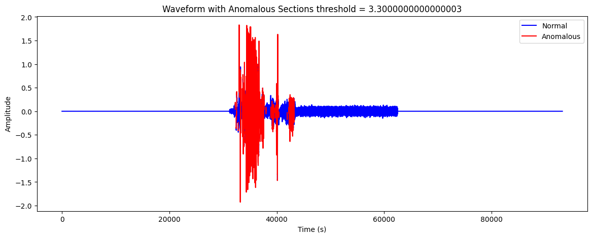

# Anomaly Detection in Fibre Optic Monitoring using Autoencoders

## Project Overview

This project aims to detect anomalies in **fibre optic monitoring data** using an unsupervised deep learning approach based on **autoencoders**. We assume that the normal behaviour is captured in a training audio (`combined_audio.flac`), while the test files (e.g. from `fibre_shaking`) may contain events such as tampering or shaking.

By training an autoencoder on normal data, we measure how well it reconstructs new input. Poor reconstruction is interpreted as an anomaly.

---

## Workflow Summary

### 1. **Preprocessing Audio Data**

* Load stereo audio (normal case: `combined_audio.flac` or test file).
* Compute the **State of Polarization (SoP)**: `sop = y[0] - y[1]`.
* Apply a **Butterworth low-pass filter** (cutoff at 300 Hz).
* Apply **pre-emphasis filtering**.
* Extract **MFCC features** using Librosa (13 coefficients, dropping the 0th).
* Normalize the features using `StandardScaler` (trained on normal data).

### 2. **Training the Autoencoder**

* A PyTorch-based autoencoder is defined:

  * Encoder: 12 → 128 → 64 → 16 (latent)
  * Decoder: 16 → 64 → 128 → 12
* Trained using **MSE loss** with **Adam optimizer**.
* Implements **early stopping** based on validation loss.
* Saves the best model and the fitted scaler.

### 3. **Anomaly Detection**

* Preprocess test audio the same way as training.
* Use the trained autoencoder to compute **reconstruction error**.
* Define anomaly **threshold** as the 95th percentile of training errors.
* Flag time frames with error above threshold as anomalies.

### 4. **Visualization**

* Plot the reconstruction error over time.
* Display detected anomalies and threshold line.

---

## Files and Code Structure

* `combined_audio.flac`: Normal (non-event) training audio
* `fibre_shaking/*.flac`: Test audio with potential anomalies
* `best_autoencoder.pth`: Saved model weights
* `scaler.pkl`: Saved `StandardScaler` instance
* `autoencoder_anomaly.py` (from notebook): Full pipeline implementation
* `prelim_tests.ipynb` was for testing out initial ideas
* `test_01.ipynb` was for testing out training the autoencoder and making sure it is able to classify anomalies based on a certain threshold

---

## How to Use

### 1. Prepare Your Environment

```bash
pip install numpy scipy librosa matplotlib scikit-learn torch joblib
```

### 2. Run the Notebook or Script

Ensure you have `combined_audio.flac` and test `.flac` file paths ready.

### 3. Modify the Test File Path

In the script:

```python
mfcc_test = process_audio_for_anomaly_detection('/path/to/test_audio.flac')
```

Replace the path with your test audio file.

---

## Future Improvements

* **Segmentation** and **timestamp annotation** of events (what we seek to do next)
* Apply **dynamic thresholding** or adaptive learning
* Expand to real-time streaming scenarios

---

## Authors

* Kenneth Dotse
* Akresi Lloyd

---

## License

This project is for academic/research purposes. Adapt freely with attribution.


  
*Figure 1: Example output showing detected anomalies in fibre optic data.*